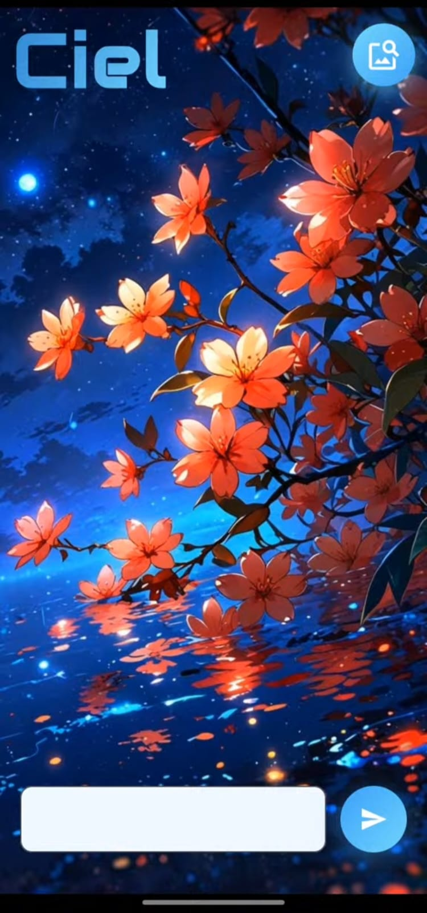
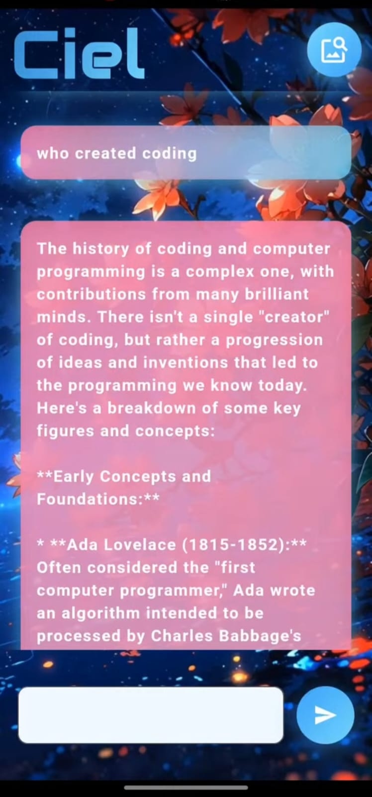
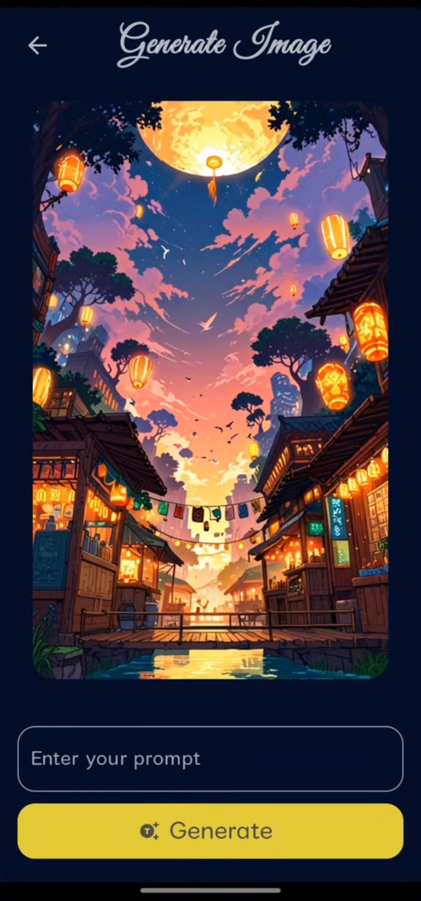
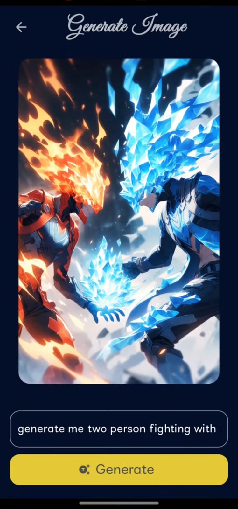

# 🤖 AI Chatbot App

A conversational AI mobile application built with **Flutter** and powered by the **Gemini API** for real-time intelligent responses.  
The app also includes an **AI Image Generator** feature that allows users to create images from text prompts.  

## 🚀 Features
- **AI Chat** – Natural conversational experience powered by Gemini API  
- **Image Generation** – Generate images from text prompts  
- **Responsive UI** with clean design  
- **State Management** using BLoC  
- **API Integration** with Dio for efficient network handling  

## 📸 Screenshots

| Home | Image Generator | Generator Input | Result |
|------|-----------------|-----------------|--------|
|  |     |  |  |

## 📱 App Flow
1. **Home Screen** → Start chatting with the AI assistant.  
2. **AI Chat** → Get real-time answers to queries.  
3. **Image Generator** → Enter a text prompt.  
4. **Result Screen** → View and save AI-generated images.  

## 🛠️ Tech Stack
- **Framework**: Flutter (Dart)  
- **State Management**: BLoC  
- **Networking**: Dio  
- **AI Backend**: Gemini API  

---

📌 This project demonstrates my ability to integrate **AI services**, build scalable **state management** with BLoC, and create modern, user-friendly Flutter apps.
